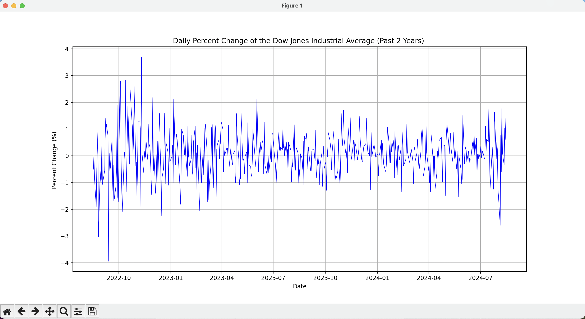

# Don's Run

To run the program, you need to have Python 3 installed on your computer. You can download it from the official website: https://www.python.org/downloads/

Once you have Python 3 installed, you can run the program by executing the following command in the **terminal**:

```bash
python3 -m venv venv
source venv/bin/activate
pip install -r requirements.txt
python donsrun.py
```

This will start the program and you will see the output in the terminal. (Well, in a window like a web browser.)

Windows users can use the following commands in the **command prompt**:

```cmd
python -m venv venv
venv\Scripts\activate
pip install -r requirements.txt
python donsrun.py
```

This will start the program and you will see the output in the command prompt. 
The "terminal" in Windows is called the "command prompt".
You can get to it via the Start menu, or by typing `cmd` in the search bar.

See [Output Graph](./DJIA-2yr.png)  for an example of the output.
